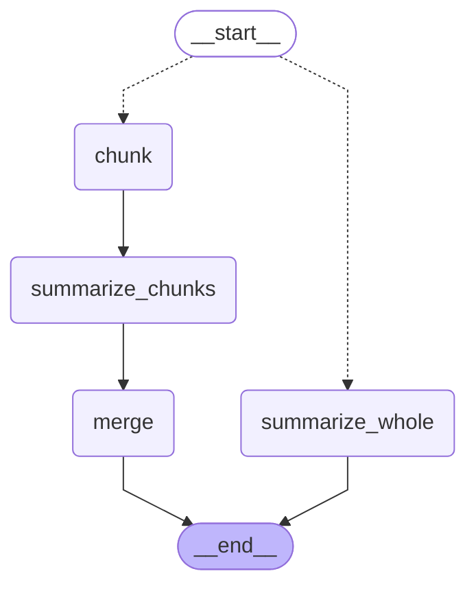

# Summarization pipeline

Generated from the compiled `StateGraph` in [`assistant/orchestration.py`](../assistant/orchestration.py).
Regenerate with `python scripts/render_graph.py` — don't edit this file by hand.

## How it reads

The entry edge is conditional on `document.token_estimate <= threshold`:

| Path | When | Calls |
| ---- | ---- | ----- |
| `summarize_whole` | Document fits under the threshold | 1 |
| `chunk` → `summarize_chunks` → `merge` | Document exceeds it | 1 per chunk, plus 1 merge |

A document sitting exactly on the threshold takes the whole-document path —
the comparison is `<=`, matching the behavior this graph replaced.

`chunk` delegates to `chunk_document()` in `ingestion/normalize.py`, so chunks
break on speaker-turn boundaries for transcripts and paragraph boundaries
otherwise, with ~500 tokens of overlap.
